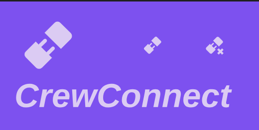

# CrewConnect - Employee Management Portal  
An Open-Source HR & Workforce Management Solution

CrewConnect

## **📌 Overview**  


**CrewConnect** is a **full-stack employee management system** designed to modernize HR operations, team collaboration, and workforce analytics. It serves as a centralized platform for businesses to manage employee data, attendance, tasks, and reporting in one place.  

### **🔗 Live Demo**  
👉 [https://crewconnect-employeeportal.netlify.app/](#) 

## **✨ Key Features**  

### **👥 Employee Management**  
- **Profile System**: Employee directories with contact info, roles, and departments.  
- **Onboarding**: Digital onboarding workflows for new hires.  
- **Role-Based Access**: Admins, Managers, and Employees have different permissions.  

### **⏱ Attendance & Leave Tracking**  
- **Clock In/Out**: Employees can log work hours.  
- **Leave Requests**: Submit and approve time-off requests.  
- **Timesheets**: Automated attendance reports.  

### **📌 Task Management**  
- **Tasks**: Manage there own ToDo Tracker 
- **Progress Tracking**: Employees update task status (To-Do, In Progress, Done).  
- **Notifications**: Alerts for new tasks and deadlines.  

### **📊 Reporting & Analytics**  
- **Employee Performance**: Track productivity metrics.  
- **Attendance Reports**: Export monthly/yearly logs.  
- **Custom Dashboards**: Visualize workforce data.  

### **🔐 Security & Authentication**  
- **JWT Authentication**: Secure login system.  
- **Password Encryption**: BCrypt for stored passwords.  
- **Session Management**: Auto-logout after inactivity.  

### **📱 Responsive Design**  
- Works on **desktop, tablet, and mobile**.  

---

## **🛠 Tech Stack**  

| **Category**       | **Technology** |  
|--------------------|--------------|  
| **Frontend**       | React.js, Bootstrap 5, CSS3 |  
| **Backend**        | Node.js, Express.js |  
| **Database**       | MongoDB (Mongoose) |  
| **Authentication** | JWT, BCrypt |  
| **API Testing**    | Postman |  
| **Version Control**| GitHub |  

---

## **🚀 Installation & Setup**  

### **Prerequisites**  
- **Node.js** (v16+)  
- **MongoDB Atlas** (or local MongoDB)  
- **Git**  

### **1. Clone the Repository**  
```sh
git clone 
cd CrewConnect-EmployeePortal
```

### **2. Install Dependencies**  

```sh
# Install backend dependencies
cd server
npm install

# Install frontend dependencies
cd ../client
npm install
```

### **3. Set Up Environment Variables**  
Create a `.env` file in the `server` folder:  
```env
PORT=5000
MONGODB_URI=mongodb+srv://<username>:<password>@cluster0.example.mongodb.net/crewconnect
```
### **4. Run the Application**  
#### Run Frontend & Backend Separately**  
```sh
# Start backend (from /server)
node server.js

# Start frontend (from /client)
npm start
```
- **Frontend**: `https://crewconnect-employeeportal.netlify.app/`  
- **Backend API**: `https://crewconnect-employeeportal.onrender.com`  

---

## **📂 Project Structure**  
```  
CrewConnect-EmployeePortal/  
├── client/               # React Frontend  
│   ├── public/           # Static files  
│   ├── src/              # React components  
│   │   ├── components/   # Reusable UI  
│   │   ├── pages/        # Main views (Dashboard, Tasks, etc.)  
│   │   ├── App.js        # Main App Router  
│   │   └── index.js      # React entry point  
│   └── package.json      # Frontend dependencies  
│  
├── server/               # Node.js Backend  
│   ├── models/           # MongoDB Schemas  
│   ├── routes/           # API Endpoints  
│   ├── controllers/      # Business logic  
│   ├── middleware/       # Auth & validation  
│   ├── config/           # DB & JWT setup  
│   └── server.js         # Express entry point  
│  
├── .gitignore  
├── README.md             # This file  
└── package.json          # Root dependencies (if any)  
```  

---
  
## **🔌 API Endpoints**

### **Authentication**
- `POST /register` - Create new account  
  ```json
  { "email": "user@example.com", "password": "secret123", "name": "John Doe" }
  ```
- `POST /login` - Login user  
  ```json
  { "email": "user@example.com", "password": "secret123" }
  ```

### **User Management**
- `GET /users` - Get all users  
- `GET /users/:id` - Get user by ID  
- `PUT /users/:id` - Update user profile  

### **Attendance**
- `POST /api/attendance/clock-in` - Start work shift  
- `POST /api/attendance/clock-out` - End work shift  
- `GET /api/attendance/:userId` - Get attendance history  

### **Leave Requests**
- `POST /leave-requests` - Submit new leave request  
  ```json
  { "userId": "123", "startDate": "2023-01-01", "endDate": "2023-01-05" }
  ```
- `GET /leave-requests` - Get all requests (admin only)  

### **Other Features**
- `GET /projects` - List all projects  
- `POST /todos` - Create new task  
- `POST /moods` - Submit mood tracker entry  

---

## **🖼 Demo Video** 
 <video controls src="Demo.mp4" title="Title"></video>
---

## **📧 Contact & Support**  
- **GitHub**: [@ThilagaMC](https://github.com/ThilagaMC)  
- **Email**: *thilaga2k2@gmail.com*  
---

### **🎉 Thank You!**  
If you find this project useful, consider giving it a **⭐ Star** on GitHub!  
